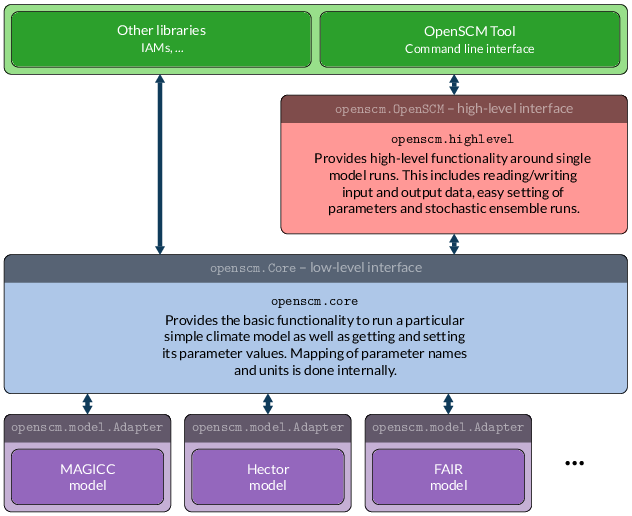

OpenSCM
=======

+----------------+-----------+--------+
| |Build Status| | |Codecov| | |Docs| |
+----------------+-----------+--------+

.. sec-begin-index

The **Open Simple Climate Model framework** unifies access to several
simple climate models (SCMs). It defines a standard interface for
getting and setting model parameters, input and output data as well as
for running the models. Additionally, OpenSCM provides a standardized
file format for these parameters and scenarios including functions for
reading and writing such files. Its high-level interface further adds
convenience functions and easily enables stochastic ensemble runs,
e.g. for model tuning.

Being designed as a programming-language agnostic interface and
standard in mind, this will be the reference implementation in
Python 3.

This OpenSCM implementation comes with a command line tool
``openscm``.

.. sec-end-index

Documentation
-------------

Detailed documentation is given on `ReadTheDocs
<https://openscm.readthedocs.io/en/latest/>`_.

Schema
------

.. sec-begin-installation

Installation
------------

OpenSCM will be made available via ``pip``. 

To install OpenSCM and all the dependencies required to run the example 
notebooks the required command is ``pip install openscm[notebooks]``.
To install only the minimum requirements to run OpenSCM, the required 
command is ``pip install openscm``.

OpenSCM comes with model adapters only for some very simple SCMs. If
you want to run other models, you will also need to install their
corresponding OpenSCM adapters [TODO: write/link to these instructions].

.. sec-end-installation
.. sec-begin-quickstart

Quickstart
----------

.. sec-end-quickstart
.. sec-begin-development

Development
-----------

.. code:: bash

    git clone git@github.com:openclimatedata/openscm.git
    pip install -e .

Tests can be run locally with

::

    python setup.py test

.. sec-end-development

Maintainers
-----------

Current maintainers of OpenSCM are:

-  `Robert Gieseke <http://github.com/rgieseke>`__
   <`robert.gieseke@pik-potsdam.de
   <mailto:robert.gieseke@pik-potsdam.de>`__>
-  `Zeb Nicholls <http://github.com/znicholls>`__
   <`zebedee.nicholls@climate-energy-college.org
   <mailto:zebedee.nicholls@climate-energy-college.org>`__>
-  `Sven Willner <http://github.com/swillner>`__
   <`sven.willner@pik-potsdam.de
   <mailto:sven.willner@pik-potsdam.de>`__>

.. |Build Status| image:: https://img.shields.io/travis/openclimatedata/openscm.svg
    :target: https://travis-ci.org/openclimatedata/openscm
.. |Docs| image:: https://img.shields.io/badge/docs-latest-brightgreen.svg?style=flat
    :target: https://openscm.readthedocs.io/en/latest/
.. |Codecov| image:: https://img.shields.io/codecov/c/github/openclimatedata/openscm.svg
    :target: https://codecov.io/gh/openclimatedata/openscm
