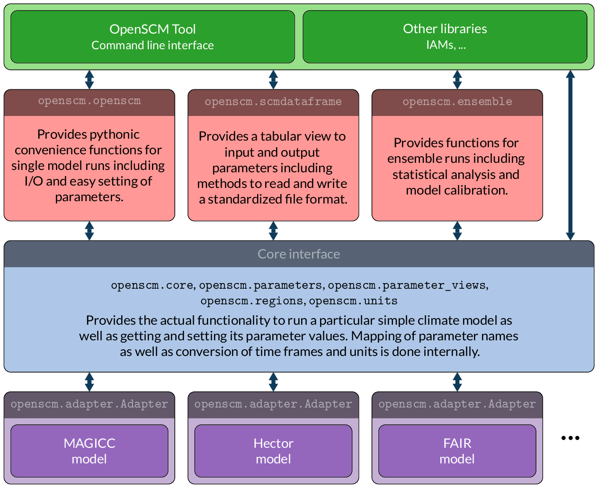

OpenSCM
=======

.. include:: ../README.rst
    :start-after: sec-begin-index
    :end-before: sec-end-index

Schema
------

.. toctree::
    :maxdepth: 2
    :caption: Documentation

    installation
    tool
    quickstart
    usage
    models
    development

.. toctree::
    :maxdepth: 2
    :caption: Standards

    parameters
    fileformats

.. toctree::
    :maxdepth: 2
    :caption: API reference

    lowlevel
    highlevel
    adapter
    errors
    timeframes
    units

.. toctree::
    :maxdepth: 2
    :caption: Versions

    changelog
